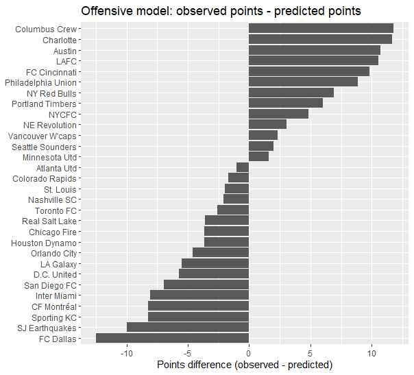
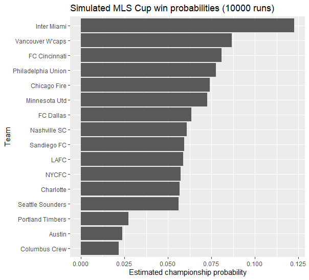

# 2025-MLS-Cup-Simulation
This is the final project of the course: STT 832_Data Visualization and Programming in R in the Sports Analytics Graduate Certificate program at Michigan State University.

# ⚽ MLS Performance Analysis & Championship Simulation

  

## 📖 Project Overview
This project investigates the determinants of team success in Major League Soccer (MLS) by analyzing the comparative impact of offensive versus defensive metrics. Using **Poisson Regression models** and **Monte Carlo Simulations (10,000 runs)**, this study not only quantifies the efficiency of attacking plays but also forecasts the MLS Cup probabilities based on team strength derived from regular-season performance.

> **Key Result:** The simulation model identified **Inter Miami** as the favorite (approx. 12% win probability), which aligned with the actual MLS Cup outcome.

## 🎯 Research Questions
1. **Efficiency vs. Volume:** Does shot volume (Quantity) or shot quality/finishing (Quality/Efficiency) contribute more to winning?
2. **Offense vs. Defense:** Which phase of the game explains more variance in winning percentage?
3. **Predictive Modeling:** Can we simulate the MLS Cup playoffs using team strength parameters derived from a Poisson distribution?

## 🛠️ Tech Stack & Methodology
* **Data Wrangling:** `dplyr`, `tidyr` (Merging FBref data, Handling Missing Values)
* **Statistical Modeling:**
    * **Poisson Regression:** Modeled Wins (W) and Losses (L) with `offset(log(MP))` to account for matches played.
    * **Logit-Linear Regression:** Analyzed Winning Percentage (WinPct).
* **Simulation:** **Monte Carlo Simulation** to replicate the MLS Cup bracket 10,000 times based on win probabilities derived from team strength.
* **Visualization:** `ggplot2`, `GGally` (Correlation Matrices, Residual Plots).

## 📊 Key Findings

### 1. Efficiency Over Volume
Contrary to the common belief that "more shots = more wins," the Poisson regression analysis revealed that **volume metrics (Total Shots)** were not statistically significant predictors of wins due to multicollinearity.
Instead, efficiency metrics were the key drivers:
* **npxG/Sh (Non-penalty xG per shot):** Significant positive predictor ($p < .01$).
* **G-xG (Goals minus Expected Goals):** Significant positive predictor ($p < .05$).

*This suggests that creating high-quality chances and finishing ability are more critical than simple shot volume.*

### 2. Model Performance & "Over-Performers"
The offensive Poisson model successfully captured the overall distribution of points. However, residual analysis highlighted teams that over/under-performed relative to their underlying metrics.


*Figure: Residuals (Observed Points - Predicted Points). Teams like Columbus Crew and Charlotte significantly outperformed their offensive expectations.*

### 3. Championship Simulation
Using the strength parameters from the Poisson model, I simulated the playoff bracket 10,000 times.
* **Projected Favorite:** Inter Miami (~12%)
* **Reality Check:** Inter Miami actually won the MLS Cup.

 
*(Note: Please replace the link above with 'Graph_simulated_probabilities.png' if you upload the bar chart of probabilities)*

## 💻 Code Structure
The analysis is broken down into the following steps:
1.  **Data Cleaning:** Renaming variables for R-consistency, merging Offense/Defense/Possession datasets via `inner_join`.
2.  **Correlation Analysis:** Identifying collinearity among `Sh`, `SoT`, and `SCA`.
3.  **GLM Fitting:**
    ```r
    # Example: Poisson Regression for Wins
    fit_W_off <- glm(
      W ~ off_npxG.Sh + off_G.xG + offset(log(MP)),
      data = dat,
      family = poisson(link = "log")
    )
    ```
4.  **Playoff Simulation:**
    ```r
    # Simulating a single match based on team strengths
    simulate_match <- function(teamA, teamB, strength_df) {
      sA <- get_strength(teamA, strength_df)
      sB <- get_strength(teamB, strength_df)
      pA <- sA / (sA + sB) # Win probability derived from relative strength
      winner <- ifelse(runif(1) < pA, teamA, teamB)
      return(winner)
    }
    ```

## 🚀 How to Run
1.  Clone the repository.
2.  Ensure the data files are in the working directory.
3.  Run the R script:
    ```R
    source("scripts/MLS_Analysis_Simulation.R")
    ```

## 👤 Author
**Haeyong Chun**
* Ph.D. Candidate in Sport Psychology (Focus on Quantitative Methods)
* [linkedin webpage (https://www.linkedin.com/in/haeyong-chun-417256383/)] | [Email(chunhaey@msu.edu)]
